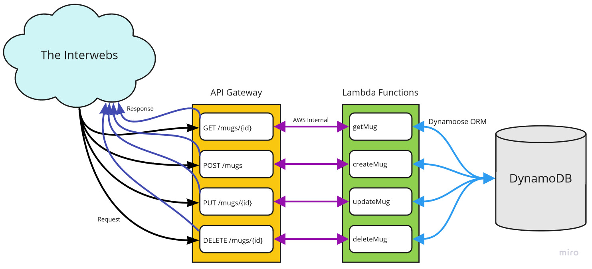

# LAB - Class 18

## Project: AWS Lambda with API Gateway

### Author: Jeremy Penning

### Links and Resources

- [AWS API Gateway Root](https://ghpr8nzqbd.execute-api.us-west-2.amazonaws.com/)

## API Endpoints - /mug

### Postman Collection

[Postman Collection JSON](./assets/postmanCollection.json)

### **POST /mug** - (Make a mug)

**Required Parameters:**

>Request Body:
>- capacity - _Number_
>- color - _Array_  
>- droppable - _Boolean_  

>Response (200) Body:
>- id - _String_
>- capacity - _Number_
>- color - _Array_  
>- droppable - _Boolean_

>Response (500) Body:
>- message - _String_

### **GET /mug/** - (Get all mugs)

>Response (200) Body:
>- id - _String_
>- capacity - _Number_
>- color - _Array_  
>- droppable - _Boolean_

>Response (500) Body:
>- message - _String_

### **GET /mug/{id}** - (Gets one mug)

**Required Parameters:**

>Query:  
>- {id} - _String_

>Response (200) Body:
>- id - _String_
>- capacity - _Number_
>- color - _Array_  
>- droppable - _Boolean_

>Response (500) Body:
>- message - _String_

### **PUT /mug/{id}** - (Update a mug)

**Required Parameters:**

>Query:  
>- {id} - _Number_

>Request Body:  
>- capacity - _Number_
>- color - _Array_  
>- droppable - _Boolean_

>Response (200) Body:
>- id - _String_
>- capacity - _Number_
>- color - _Array_  
>- droppable - _Boolean_

>Response (500) Body:
>- message - _String_

### **DELETE /mug/{id}** - (Deletes one mug)

**Required Parameters:**

>Query:  
>- {id} - _Number_

>Response (200) Body:
>- message - _String_

>Response (500) Body:
>- message - _String_

---

## Whiteboard(s) / UML

